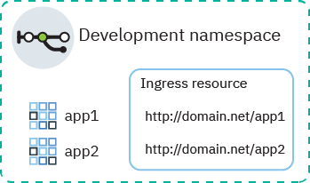

---

copyright:
  years: 2014, 2023
lastupdated: "2023-05-09"

keywords: openshift, nginx, ingress controller, openshift ingress, ingress, exposing apps

subcollection: openshift

---

{{site.data.keyword.attribute-definition-list}}

# Planning your Ingress setup
{: #ingress-roks4}

Expose multiple apps in your {{site.data.keyword.openshiftlong}} cluster by creating Ingress resources that are managed by the Ingress controller.
{: shortdesc}

This information is for clusters that run {{site.data.keyword.redhat_openshift_notm}} version 4 only.
{: note}

For information about how to expose apps in {{site.data.keyword.satelliteshort}}, see [Exposing apps in {{site.data.keyword.satelliteshort}} clusters](/docs/openshift?topic=openshift-sat-expose-apps).
{: tip}

## Planning networking for single or multiple projects
{: #multiple_projects}

One Ingress resource is required per project where you have apps that you want to expose.
{: shortdesc}

### All apps are in one project
{: #one-project}

If the apps in your cluster are all in the same project, you must create one Ingress resource to define the routing rules for the apps that you want to expose.
{: shortdesc}

For example, if you have `app1` and `app2` exposed by services in a development project, you can create an Ingress resource in the project. The resource specifies `domain.net` as the host and registers the paths that each app listens on with `domain.net`.

{: caption="Figure 1. One resource is required per project" caption-side="bottom"}

Note that if you want to use different domains for the apps within the same project, you can create one resource per domain.

### Apps are in multiple projects
{: #multi-project}

If the apps in your cluster are in different projects, you must create one Ingress resource for each project to define the app's routing rules.
{: shortdesc}

You can either define the same domain in multiple resources, or use a wildcard domain to specify different subdomains within the Ingress resource for each project.

When a wildcard domain is registered, multiple subdomains can all resolve to the same host. The IBM-provided Ingress subdomain wildcard, `*.<cluster_name>.<globally_unique_account_HASH>-0000.<region>.containers.appdomain.cloud`, is registered by default for your cluster.{: #wildcard_tls}

The IBM-provided TLS certificate is a wildcard certificate and can be used for the wildcard subdomain. If you want to use a wildcard custom domain, you must register the custom domain as a wildcard domain such as `*.custom_domain.net`, and to use TLS, you must get a wildcard certificate.
{: note}

For example, consider the following scenario in which you might want to use a wildcard subdomain:
* You have two versions of the same app, `app1` and `app3`, for testing purposes.
* You deploy the apps in two different projects within the same cluster: `app1` into the development project, and `app3` into the staging project.

To use different subdomains to manage traffic to these apps, you create the following services and resources:
* A Kubernetes service in the development project to expose `app1`.
* An Ingress resource in the development project that specifies the host as `dev.domain.net`.
* A Kubernetes service in the staging project to expose `app3`.
* An Ingress resource in the staging project that specifies the host as `stage.domain.net`.

{: caption="Figure 1. Subdomains in one or multiple resources within a project" caption-side="bottom"}

Now, both URLs resolve to the same domain. However, because the resource in the staging project is registered with the `stage` subdomain, the Ingress controller correctly proxies requests from the `stage.domain.net/app3` URL to only `app3`.

### Multiple domains within a project
{: #multi-domains-project}

Within an individual project, you can use one domain to access all the apps in the project. If you want to use different domains for the apps within an individual project, use a wildcard domain. When a wildcard domain is registered, multiple subdomains all resolve to the same host. Then, you can use one resource to specify multiple subdomain hosts within that resource. Alternatively, you can create multiple Ingress resources in the project and specify a different subdomain in each Ingress resource.
{: shortdesc}

{: caption="Figure 1. One resource is required per project" caption-side="bottom"}

The IBM-provided Ingress subdomain wildcard, `*.<cluster_name>.<globally_unique_account_HASH>-0000.<region>.containers.appdomain.cloud`, is registered by default for your cluster. The IBM-provided TLS certificate is a wildcard certificate and can be used for the wildcard subdomain. If you want to use a wildcard custom domain, you must register the custom domain as a wildcard domain such as `*.custom_domain.net`, and to use TLS, you must get a wildcard certificate.
{: note}

## Customizing Ingress routing with annotations
{: #annotations-roks4}

If you want to customize routing rules for your app, you can use [route-specific HAProxy annotations](https://docs.openshift.com/container-platform/4.11/networking/routes/route-configuration.html#nw-route-specific-annotations_route-configuration){: external} in the Ingress resources that you define.

These supported annotations are in the format `haproxy.router.openshift.io/<annotation>` or `router.openshift.io/<annotation>`.{{site.data.keyword.containerlong_notm}} annotations (`ingress.bluemix.net/<annotation>`) and NGINX annotations (`nginx.ingress.kubernetes.io/<annotation>`) are not supported for the Ingress controller or the Ingress resource in {{site.data.keyword.redhat_openshift_notm}} version 4.
{: important}

