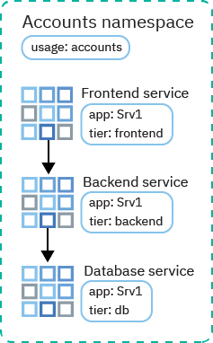
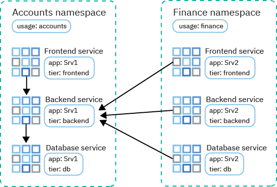

---

copyright: 
  years: 2014, 2023
lastupdated: "2023-10-05"

keywords: openshift, firewall, acl, acls, access control list, rules, security group

subcollection: openshift


---

{{site.data.keyword.attribute-definition-list}}


# Controlling traffic between pods with Kubernetes policies
{: #vpc-kube-policies}

[Virtual Private Cloud]{: tag-vpc}

You can use Kubernetes policies to control network traffic between pods in your cluster and to isolate app microservices from each other within a namespace or across namespaces.
{: shortdesc}

**Level of application**: Worker node host endpoint

**Default behavior**: No Kubernetes network policies exist by default in your cluster. By default, any pod has access to any other pod in the cluster. Additionally, any pod has access to any services that are exposed by the pod network, such as a metrics service, the cluster DNS, the API server, or any services that you manually create in your cluster.

**Use case**: Kubernetes network policies specify how pods can communicate with other pods and with external endpoints. Both incoming and outgoing network traffic can be allowed or blocked based on protocol, port, and source or destination IP addresses. Traffic can also be filtered based on pod and namespace labels. When Kubernetes network policies are applied, they are automatically converted into Calico network policies. The Calico network plug-in in your cluster enforces these policies by setting up Linux Iptables rules on the worker nodes. Iptables rules serve as a firewall for the worker node to define the characteristics that the network traffic must meet to be forwarded to the targeted resource.

If most or all pods don't require access to specific pods or services, and you want to ensure that pods by default can't access those pods or services, you can create a Kubernetes network policy to block ingress traffic to those pods or services.

For more information about how Kubernetes network policies control pod-to-pod traffic and for more example policies, see the [Kubernetes documentation](https://kubernetes.io/docs/concepts/services-networking/network-policies/){: external}.
{: tip}

## Isolate app services within a namespace
{: #services_one_ns}

The following scenario demonstrates how to manage traffic between app microservices within one namespace.
{: shortdesc}

An Accounts team deploys multiple app services in one namespace, but they need isolation to permit only necessary communication between the microservices over the public network. For the app `Srv1`, the team has front end, back end, and database services. They label each service with the `app: Srv1` label and the `tier: frontend`, `tier: backend`, or `tier: db` label.

{: caption="Figure 2. Use a network policy to manage namespace traffic" caption-side="bottom"}

The Accounts team wants to allow traffic from the front end to the back end, and from the back end to the database. They use labels in their network policies to designate which traffic flows are permitted between microservices.

First, they create a Kubernetes network policy that allows traffic from the front end to the back end:

```yaml
kind: NetworkPolicy
apiVersion: networking.k8s.io/v1
metadata:
  name: backend-allow
spec:
  podSelector:
    matchLabels:
      app: Srv1
      tier: backend
  ingress:
  - from:
    - podSelector:
        matchLabels:
          app: Srv1
          Tier: frontend
```
{: codeblock}

The `spec.podSelector.matchLabels` section lists the labels for the Srv1 back-end service so that the policy applies only _to_ those pods. The `spec.ingress.from.podSelector.matchLabels` section lists the labels for the Srv1 front-end service so that ingress is permitted only _from_ those pods.

Then, they create a similar Kubernetes network policy that allows traffic from the back end to the database:

```yaml
kind: NetworkPolicy
apiVersion: networking.k8s.io/v1
metadata:
  name: db-allow
spec:
  podSelector:
    matchLabels:
      app: Srv1
      tier: db
  ingress:
  - from:
    - podSelector:
        matchLabels:
          app: Srv1
          Tier: backend
```
{: codeblock}

The `spec.podSelector.matchLabels` section lists the labels for the Srv1 database service so that the policy applies only _to_ those pods. The `spec.ingress.from.podSelector.matchLabels` section lists the labels for the Srv1 back-end service so that ingress is permitted only _from_ those pods.

Traffic can now flow from the front end to the back end, and from the back end to the database. The database can respond to the back end, and the back end can respond to the front end, but no reverse traffic connections can be established.

## Isolate app services between namespaces
{: #services_across_ns}

The following scenario demonstrates how to manage traffic between app microservices across multiple namespaces.
{: shortdesc}

Services that are owned by different sub teams need to communicate, but the services are deployed in different namespaces within the same cluster. The Accounts team deploys front end, back end, and database services for the app Srv1 in the accounts namespace. The Finance team deploys front end, back end, and database services for the app Srv2 in the finance namespace. Both teams label each service with the `app: Srv1` or `app: Srv2` label and the `tier: frontend`, `tier: backend`, or `tier: db` label. They also label the namespaces with the `usage: accounts` or `usage: finance` label.

{: caption="Figure 2. Use a network policy to manage cross-namespace traffic" caption-side="bottom"}

The Finance team's Srv2 needs to call information from the Accounts team's Srv1 back end. So the Accounts team creates a Kubernetes network policy that uses labels to allow all traffic from the finance namespace to the Srv1 back end in the accounts namespace. The team also specifies the port 3111 to isolate access through that port only.

```yaml
kind: NetworkPolicy
apiVersion: networking.k8s.io/v1
metadata:
  Namespace: accounts
  name: accounts-allow
spec:
  podSelector:
    matchLabels:
      app: Srv1
      Tier: backend
  ingress:
  - from:
    - NamespaceSelector:
        matchLabels:
          usage: finance
      ports:
        port: 3111
```
{: codeblock}

The `spec.podSelector.matchLabels` section lists the labels for the Srv1 back-end service so that the policy applies only _to_ those pods. The `spec.ingress.from.NamespaceSelector.matchLabels` section lists the label for the finance namespace so that ingress is permitted only _from_ services in that namespace.

Traffic can now flow from finance microservices to the accounts Srv1 back end. The accounts Srv1 back end can respond to finance microservices, but can't establish a reverse traffic connection.

In this example, all traffic from all microservices in the finance namespace is permitted. You can't allow traffic from specific app pods in another namespace because `podSelector` and `namespaceSelector` can't be combined.

### Required policy rules for VPCs with a cluster that runs at version  or later
{: #policy-rules-128}

In version 1.27 and earlier, VPC clusters pull images from the IBM Cloud Container Registry through a private cloud service endpoint for the Container Registry. For version  and later, this network path is updated so that images are pulled through a VPE gateway instead of a private service endpoint. This change affects all clusters in a VPC; when you create or update a single cluster in a VPC to version , all clusters in that VPC, regardless of their version or type, have their network path updated. For more information, see [Networking changes for VPC clusters](/docs/containers?topic=containers-cs_versions_128&interface=ui#networking_128).

If you have a cluster in your VPC that runs version  or later and you use Calico policies to restrict outbound connections from cluster workers, you must add the following policy rule to allow connections to the VPE Gateway for Registry. This policy must be created for each zone in the VPC and must specify the entire VPC address prefix range for the zone as the destination CIDR. To find the VPC address prefix range for each zone in the VPC, run `ibmcloud is vpc-address-prefixes <vpc_name_or_id>`.

```yaml
apiVersion: projectcalico.org/v3
kind: GlobalNetworkPolicy
metadata:
  name: allow-vpe-gateway-registry
spec:
  egress:
  - action: Allow
    destination:
      nets:
      - <entire-vpc-address-prefix-range> # example: 10.245.0.0/16
      ports:
      - 443
      - 4443
    protocol: TCP
    source: {}
  order: 500
  selector: ibm.role == 'worker_private'
  types:
  - Egress
```
{: codeblock}


